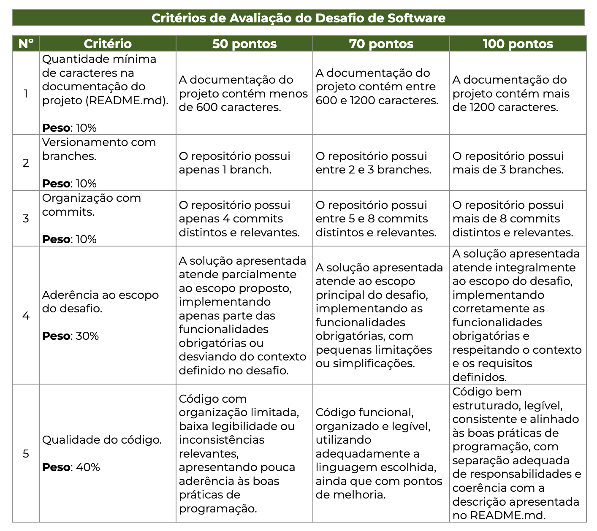

A descrição da solução desenvolvida;
As tecnologias utilizadas;
A estrutura geral do projeto;
As instruções necessárias para sua execução;
Um link para o vídeo pitch, que deverá estar referenciado diretamente no README.md.
max 3m video

Video:
solução desenvolvida, explicar suas principais funcionalidades, demonstrar brevemente o funcionamento do sistema (quando aplicável) e comentar as principais decisões técnicas adotadas.

CRUD API REST
- Nome do empreendimento;
- Nome do(a) empreendedor(a) responsável;
- Município de Santa Catarina;
- Segmento de atuação:
- Tecnologia;
- Comércio;
- Indústria;
- Serviços;
- Agronegócio.
- E-mail ou meio de contato;
- Status (ativo ou inativo).
